# Практическая работа 5
## Открываем виртуальную машину
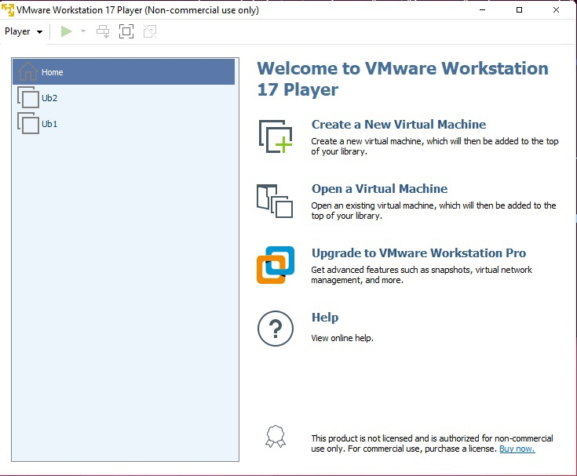
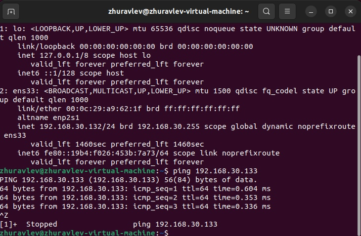
## Заходим в браузер
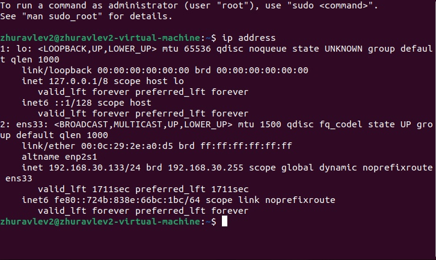
## Выбираем датасет
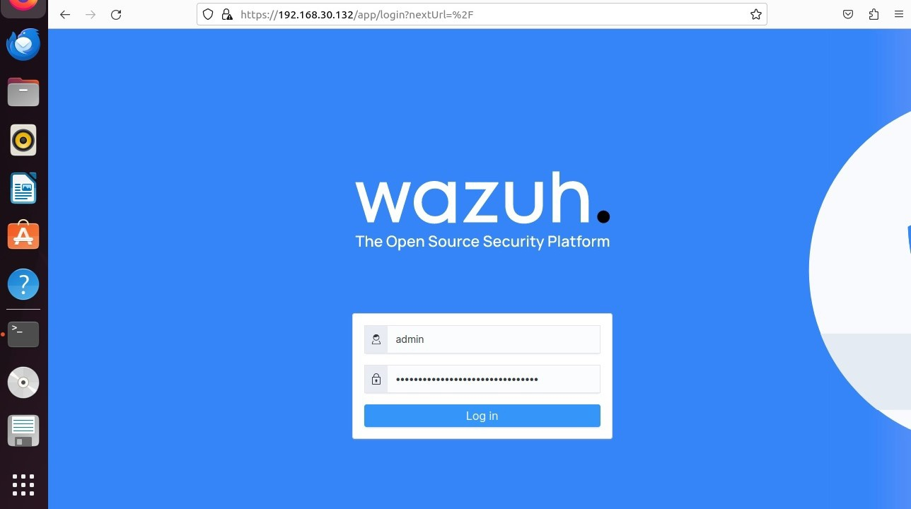
## Главная страница
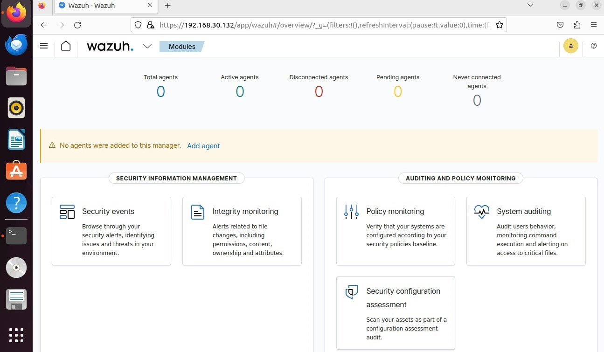
## Переходим на вкладку beacons web
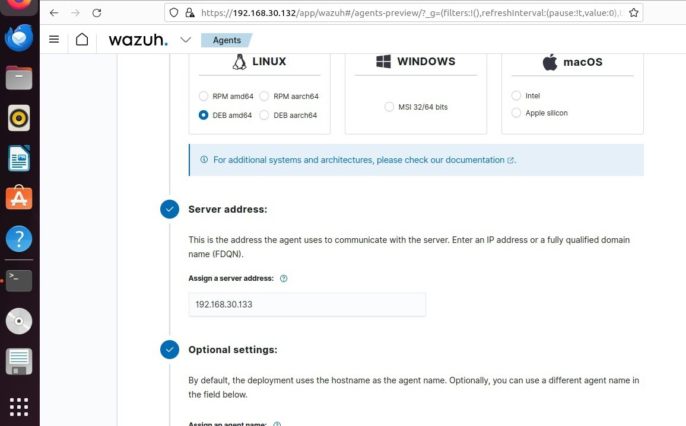
## Добавляем скайп в safalist
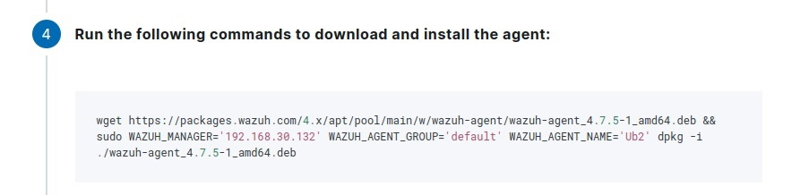
## Просматриваем safelist
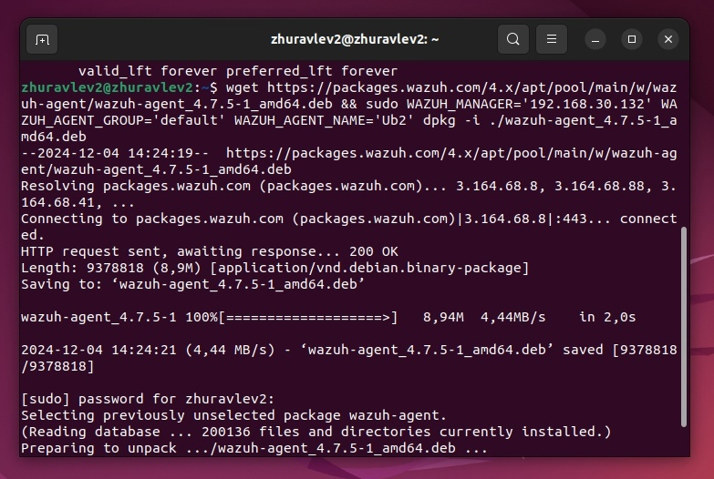
## Импортируем логи из папки lab1
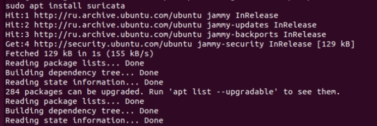
## Выбираем датасет lab1
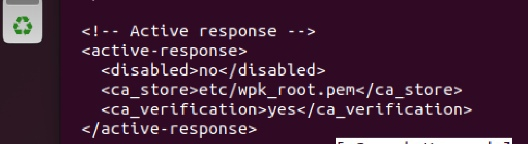
## Проверяем адреса и добавляем безопасные в safelist

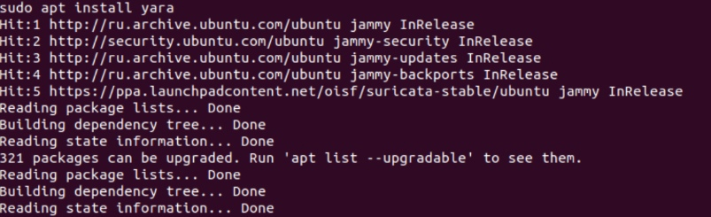
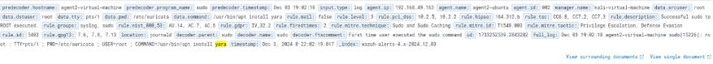

## Переходим во вкладку long connections

## Проверяем первый адрес в Virus Total

## Проверяем первый адрес в AbuseiPDB

## Проверяем второй адрес в Virus Total

## Проверяем второй адрес в AbuseiPDB

Соединения с 167.71.97.235 небезопасно
## Импортируем логи из папки lab2

## Выбираем датасет

## Переходим во вкладку DNS

Видим, что была атака с использованием протокола C2 через DNS
## Импортируем логи из папки lab3

## Главная страница

## Переходим на вкладку beacons web

## Выберем фишинговый сайт скайпа

## Проверяем через Virus Total, выявлено 5 пометок о вредоносности

## Проверка во вкладке long connections 

